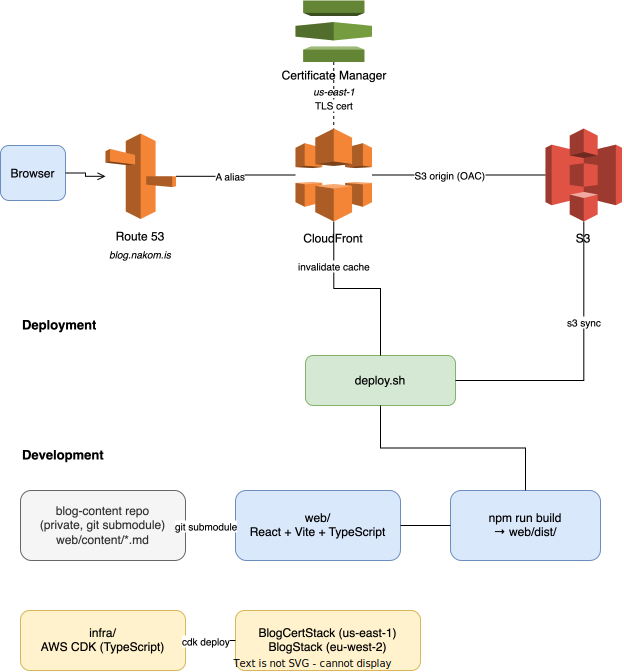

# blog.nakom.is — A Personal Blog on AWS

This project is a personal blog at [blog.nakom.is](https://blog.nakom.is), built as a React/Vite single-page application served via CloudFront from a private S3 bucket. Blog post content lives in a separate private repository linked as a git submodule, keeping the infrastructure and content concerns cleanly separated.

## Table of Contents

<!-- toc -->

- [Architecture Diagram](#architecture-diagram)
- [Repository Layout](#repository-layout)
- [Blog Content](#blog-content)
- [Components](#components)
  * [Certificate Manager](#certificate-manager)
  * [S3 Bucket](#s3-bucket)
  * [CloudFront](#cloudfront)
  * [Route53](#route53)
- [Web App](#web-app)
  * [Content Pipeline](#content-pipeline)
  * [Local Development](#local-development)
  * [Deployment](#deployment)
- [Infrastructure](#infrastructure)
- [SEO](#seo)
- [Architecture Diagrams](#architecture-diagrams)

<!-- tocstop -->

## Architecture Diagram



## Repository Layout

- `web/` — React/Vite blog frontend (TypeScript)
- `web/content/` — git submodule pointing to the private [blog-content](https://github.com/nakomis/blog-content) repo
- `web/scripts/` — build and deployment scripts
- `infra/` — AWS CDK infrastructure (TypeScript)
- `docs/architecture/` — architecture diagram source (draw.io) and exported SVG
- `.githooks/` — git hooks (SVG auto-generation on commit)

## Blog Content

Blog post markdown files live in the private [`blog-content`](https://github.com/nakomis/blog-content) repo, linked as a git submodule at `web/content/`. This keeps post content separate from the public infrastructure code.

Clone with submodules:

```bash
git clone --recurse-submodules git@github.com:nakomis/blog-app.git
```

Or, if already cloned:

```bash
git submodule update --init
```

## Components

### Certificate Manager

The [BlogCertStack](infra/lib/blog-cert-stack.ts) creates an ACM certificate covering `blog.nakomis.com` (primary) and `blog.nakom.is` (SAN) in `us-east-1`, as CloudFront requires certificates to be in that region. DNS validation is used, automatically creating the validation records in the `nakomis.com` and `nakom.is` Route53 hosted zones respectively.

This stack must be deployed before the main BlogStack since the certificate ARN is passed as a cross-stack reference.

### S3 Bucket

The [BlogStack](infra/lib/blog-stack.ts) creates a private S3 bucket (`blog-nakom-is-eu-west-2-<account>`) to store the built web assets. The bucket blocks all public access; objects are served exclusively via CloudFront using Origin Access Control (OAC), so the bucket never needs a public-read policy.

The deployment script syncs two things to the bucket:
- `web/dist/` — the compiled React application (JS, CSS, HTML, images)
- `web/content/blog/` → `s3://<bucket>/posts/` — raw markdown files, served at runtime so the app can fetch post content without a rebuild

### CloudFront

The CloudFront distribution in [BlogStack](infra/lib/blog-stack.ts) sits in front of the S3 bucket and handles:

- **HTTPS enforcement** — all HTTP requests are redirected to HTTPS
- **Legacy redirect** — requests to `blog.nakom.is` are 301-redirected to `blog.nakomis.com`, preserving the path
- **SPA routing** — 403 and 404 responses from S3 are rewritten to serve `index.html` with a 200 status, allowing React Router to handle client-side routes
- **Compression** — assets are gzip/brotli compressed
- **Caching** — the `CACHING_OPTIMIZED` managed cache policy is used for all behaviours

The ACM certificate is attached to the distribution, covering both `blog.nakomis.com` and `blog.nakom.is`.

### Route53

DNS A alias records are created for both domains:
- `blog.nakomis.com` in the `nakomis.com` hosted zone
- `blog.nakom.is` in the `nakom.is` hosted zone

Both point at the same CloudFront distribution. The hosted zones are looked up by domain name rather than imported by ID, so no manual configuration is required.

## Web App

### Content Pipeline

At build time, [`web/scripts/buildContent.ts`](web/scripts/buildContent.ts) reads all markdown files from `web/content/blog/`, processes them through a unified/remark/rehype pipeline (with frontmatter extraction and syntax highlighting), and writes a generated TypeScript file (`web/src/content.generated.ts`) containing all post HTML and metadata as a typed constant. This file is imported directly by the React app, so no runtime markdown parsing is needed for the post content itself.

At runtime, the app also fetches raw markdown files from S3 (`/posts/<slug>.md`) — this allows the post list and content to reflect whatever is synced to S3, including posts added after the last frontend build.

### Local Development

```bash
cd web
npm install
npm run dev        # local dev server on http://localhost:5173
```

### Deployment

```bash
cd web
npm run build                    # build to web/dist/
bash scripts/deploy.sh           # sync dist/ and content/blog/ to S3, invalidate CloudFront
```

`deploy.sh` uses the `nakom.is-admin` AWS profile locally. In GitHub Actions, credentials come from OIDC (no stored secrets).

### Scheduled publishing

A daily GitHub Actions workflow (`.github/workflows/scheduled-publish.yml`) runs at 08:00 UTC. It pulls the latest blog-content submodule, builds, and deploys. Posts with a `publish_date` in the past or present are included; future-dated posts are skipped.

To trigger a deploy immediately (e.g. after a manual content change): **Actions → Publish scheduled posts → Run workflow**.

## Infrastructure

Three CDK stacks — deploy in order:

```bash
cd infra
npm install
cdk deploy BlogCertStack --profile nakom.is-admin   # us-east-1 cert (first time only)
cdk deploy BlogStack --profile nakom.is-admin       # eu-west-2 S3/CloudFront/Route53
cdk deploy BlogGithubStack --profile nakom.is-admin # GitHub OIDC + deploy role (one-time setup)
```

`BlogGithubStack` imports the existing `token.actions.githubusercontent.com` OIDC provider rather than creating a new one (only one is allowed per AWS account).

## SEO

The blog generates a sitemap at build time (`/sitemap.xml`) and serves a `robots.txt`. Each post sets its own meta tags and canonical URL via the `canonical` frontmatter field.

The sitemap is submitted to Google Search Console under `sc-domain:nakom.is`. GSC is accessible via the [mcp-gsc](https://github.com/AminForou/mcp-gsc) MCP server, configured in `~/.claude.json` for use with Claude Code.

## Architecture Diagrams

`docs/architecture/blog-app.drawio` is the source for the diagram at the top of this README. The SVG is auto-generated on commit by the pre-commit hook in `.githooks/pre-commit`.

To activate the hook after cloning:

```bash
git config core.hooksPath .githooks
```

To regenerate the SVG manually:

```bash
/Applications/draw.io.app/Contents/MacOS/draw.io -x docs/architecture/blog-app.drawio -f svg -s 1 docs/architecture/blog-app.svg
```

Requires the [draw.io desktop app](https://github.com/jgraph/drawio-desktop/releases) to be installed at `/Applications/draw.io.app`.
